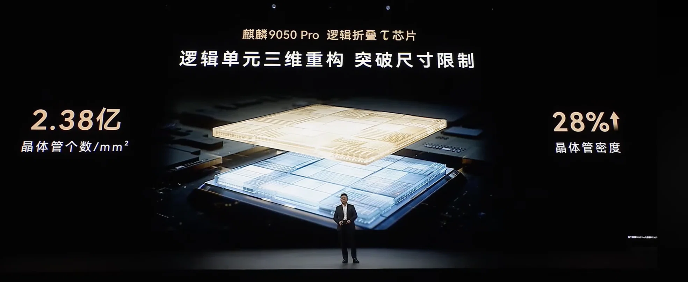

# Kirin 9050 Pro vs A20 Pro transistor density

> DeepSeek's web-searched comparison of Huawei's claimed Kirin 9050 Pro transistor density against Apple's 2nm A20 Pro for the iPhone 18.
>
> Source: [shared conversation](https://chat.deepseek.com/share/azjiy4fuwk52yvv94a) on chat.deepseek.com, 2026-10-02. 2 questions, 2 answers.
> Recovered from the shared-conversation HTML export: tables, web citations, and attached screenshots preserved.

---

## User

this is Huawei's latest claim for their top of the line Kirin 9050 Pro chip, What's the transistor density for apple's top chip for the iPhone 18 series in comparison?

---

## DeepSeek

Apple hasn't officially announced the transistor density for the iPhone 18 series chips yet, but based on TSMC's 2nm process specifications, the density for the A20 Pro is approximately **3.13亿个/mm²** (313 million transistors per square millimeter) [[21]](https://technews.tw/ai-agent/smic-surpasses-intel-in-process-technology/15737/)[[29]](https://www.design-reuse-china.com/news/202502068/2nm-intel-18a/).

### 📊 Density Comparison

| Feature | Huawei Kirin 9050 Pro | Apple A20 Pro (Estimated) |
| --- | --- | --- |
| **Transistor Density** | 2.38亿/mm² | 约3.13亿/mm² |
| **Process Node** | Not specified | TSMC 2nm (N2) |
| **Die Area** | Not specified | 约 98.2 mm² |

*Note: The A20 Pro density figure is based on TSMC's standard-cell density for the N2 process, which is the physical foundation for the chip [[21]](https://technews.tw/ai-agent/smic-surpasses-intel-in-process-technology/15737/)[[32]](https://www.eet-china.com/mp/a526920.html#1). Actual chip design can vary slightly.*

The A20 Pro's higher density comes from its use of Gate-All-Around (GAA) nanosheet transistors, which are more efficient than the FinFET technology used in previous generations [[18]](https://www.techtimes.com/articles/327936/20260923/techinsights-teardown-confirms-tsmc-2nm-nanosheet-transistors-now-inside-iphone-18-pro.htm#discussion#1)[[23]](https://www.techinsights.com/iphone-18-pro-max-idm-analysis). Despite this higher density, reports indicate Apple is keeping the A20 Pro's physical die size nearly identical to its predecessor, using the extra transistor budget to significantly expand the Neural Engine and add a GPU core, rather than shrinking the chip [[18]](https://www.techtimes.com/articles/327936/20260923/techinsights-teardown-confirms-tsmc-2nm-nanosheet-transistors-now-inside-iphone-18-pro.htm#discussion#1)[[23]](https://www.techinsights.com/iphone-18-pro-max-idm-analysis).

The standard A20 chip (for the base iPhone 18) will also use the same 2nm process, but it is expected to have a smaller die area of around 70-80 mm² and reduced specs compared to the Pro version [[37]](https://m.ithome.com/html/1009075.htm).

---

## User

yeah this is Huawei's first use of logic folding tao thingy

---

## DeepSeek

The "logic folding" in the Kirin 9050 Pro is not a traditional 3D package stacking, but a genuine architectural innovation: reconstructing an entire logic system originally laid out on a plane within a single chip, and rearranging it in three-dimensional space[[10]](http://news.cyol.com/gb/keji/articles/2026-10/02/content_ybXJXVuQ3N.html). It's like converting a single-story house into a duplex, installing "elevators" (vertical interconnect channels) inside, so signals no longer need to take "detours" horizontally, but instead connect directly vertically, greatly shortening transmission paths[[1]](https://news.qq.com/rain/a/20260908A03JSP00?id=20260908A03JSP00&path=a&app=news&suid=&redirect_pc=1#1)[[8]](https://m.163.com/dy/article/L6811VET051481US.html?spss=sps_sem).

The most intuitive comparison: Huawei, without EUV lithography equipment, "folded out" roughly three years of advancement with logic folding that would normally be achieved through geometric miniaturization[[1]](https://news.qq.com/rain/a/20260908A03JSP00?id=20260908A03JSP00&path=a&app=news&suid=&redirect_pc=1#1)[[10]](http://news.cyol.com/gb/keji/articles/2026-10/02/content_ybXJXVuQ3N.html). Compared to the previous generation Kirin 9030 Pro, transistor density surged from approximately 155 million/mm² to 238 million/mm², a 28% increase in a single generation—an improvement equivalent to the total gains Huawei achieved through process shrink over the past three years[[1]](https://news.qq.com/rain/a/20260908A03JSP00?id=20260908A03JSP00&path=a&app=news&suid=&redirect_pc=1#1)[[6]](https://www.eet-china.com/mp/a528616.html).

Regarding the comparison you asked about earlier, the specific process technology used for the Kirin 9050 Pro has not been officially disclosed, while Apple's A20 Pro is based on TSMC's 2nm process. The significant difference between the two is reflected not only in density numbers, but also in their technical paths: the former pursues "shortening signal paths" at the architectural level, while the latter relies on transistor miniaturization at the process level[[2]](https://news.cgtn.com/news/2026-10-01/Mate-90-Faster-chips-without-the-tools-Huawei-can-t-buy-1QTqyeRR8Lm/p.html).
