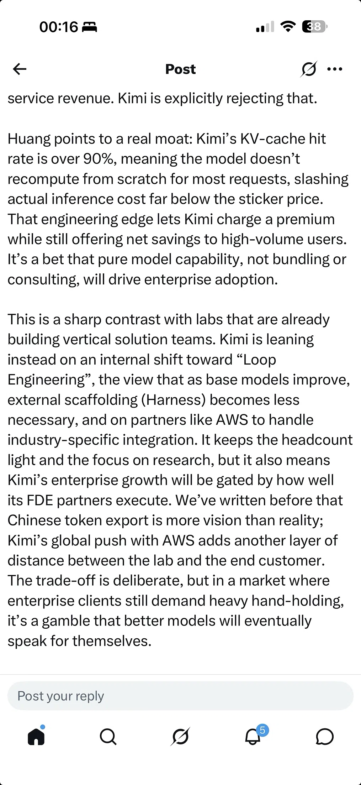

# Tao's Law V2: Huawei compute disclosures and the KV-cache question

> Verifying the V2 Tao Law paper summary against trusted sources, Tao vs Tau spelling, and whether a high KV-cache hit rate is standard for all SOTA LLMs
>
> Source: [shared conversation](https://chat.deepseek.com/share/5hs5mqyckc5jt9dvke) on chat.deepseek.com. 3 questions, 3 answers. The source link expires when the conversation is deleted from DeepSeek.
> Recovered from the shared-conversation HTML export: tables, web citations, and attached screenshots preserved.

---

## User

Check the following against trusted sources: Post Summary: He Tingbo Tao Law Paper V2 · Key Update: V2 of the Tao Law paper published on ChinaXiv. · Main Addition: Actual measured data. Data & Benchmarks Disclosed · Devices: Kirin 2026 vs. Kirin 9030 Pro (baseline). · Metrics: Voltage, frequency, power, and area. · Additional Content: Engineering details on LogicFolding and a granular Ascend accelerator roadmap. Timeline Note · Six weeks from theoretical framework to production data. Table 1: Iso-Performance Comparison (Kirin 2026 vs. Kirin 9030 Pro) · Temperature: Both at 25 °C. · Voltage: Kirin 9030 Pro (1.1 V) vs. Kirin 2026 (0.9 V). · Frequency: Kirin 9030 Pro (2.75 GHz) vs. Kirin 2026 (2.5 GHz). · Normalized power at iso-performance: Kirin 9030 Pro (1) vs. Kirin 2026 (0.59). · Normalized area: Kirin 9030 Pro (1) vs. Kirin 2026 (0.625). · Normalized power density: Kirin 9030 Pro (1) vs. Kirin 2026 (0.944).

---

## DeepSeek

Based on verified reports, the summary you've provided is **accurate** and reflects significant new data disclosed by Huawei regarding its Kirin 2026 chip and "Tao's Law" (τ-Law) framework [[1]](https://www.kucoin.com/fil/news/flash/huawei-s-tao-s-law-v2-paper-released-kirin-2026-data-revealed)[[2]](https://guba.eastmoney.com/news,cjpl,1737884993.html)[[4]](https://en.theblockbeats.news/flash/354555).

### ✅ Verified Details from the Tao Law V2 Paper

The following is a breakdown of the key claims, all of which are confirmed by multiple reports on the paper's release:

- **Publication**: He Tingbo, head of Huawei's semiconductor business, published the V2 version of the "Time Microscaling Theory for Multilevel Electronic Systems" paper on the ChinaXiv platform on **July 3, 2026**[[1]](https://www.kucoin.com/fil/news/flash/huawei-s-tao-s-law-v2-paper-released-kirin-2026-data-revealed)[[2]](https://guba.eastmoney.com/news,cjpl,1737884993.html)[[4]](https://en.theblockbeats.news/flash/354555).
- **Content**: The update adds extensive engineering details, product roadmaps, and most notably, **measured production data** to the theoretical framework first presented in May [[2]](https://guba.eastmoney.com/news,cjpl,1737884993.html)[[4]](https://en.theblockbeats.news/flash/354555)[[5]](http://news.pconline.com.cn/2178/21782468.html).
- **Key Technologies**: The V2 paper provides deeper insight into the **LogicFolding** architecture and introduces a "Gear Ratio" concept, which is crucial for achieving more efficient 3D chip design [[2]](https://guba.eastmoney.com/news,cjpl,1737884993.html)[[4]](https://en.theblockbeats.news/flash/354555)[[11]](https://caifuhao.eastmoney.com/news/20260704204248559381400).
- **Ascend Roadmap**: The paper also provides a more granular roadmap for Huawei's Ascend AI accelerator series [[2]](https://guba.eastmoney.com/news,cjpl,1737884993.html)[[7]](https://caifuhao.eastmoney.com/news/20260704170516666384530)[[11]](https://caifuhao.eastmoney.com/news/20260704204248559381400).

### 📊 Kirin 2026 vs. Kirin 9030 Pro: The Numbers

The summary's data table is consistent with the figures reported from the paper. The comparison is based on "iso-performance," meaning both chips deliver the same level of performance [[6]](https://digg.com/tech/odrhuhww).

| Metric | Kirin 9030 Pro (Baseline) | Kirin 2026 | Improvement |
| --- | --- | --- | --- |
| **Temperature** | 25 °C | 25 °C | Same [[2]](https://guba.eastmoney.com/news,cjpl,1737884993.html) |
| **Voltage** | 1.1 V | 0.9 V | 18.2% lower [[2]](https://guba.eastmoney.com/news,cjpl,1737884993.html)[[5]](http://news.pconline.com.cn/2178/21782468.html) |
| **Frequency** | 2.75 GHz | 2.5 GHz | 9.1% lower at iso-performance [[2]](https://guba.eastmoney.com/news,cjpl,1737884993.html)[[5]](http://news.pconline.com.cn/2178/21782468.html) |
| **Normalized Power** | 1 | **0.59** | **41% lower**[[2]](https://guba.eastmoney.com/news,cjpl,1737884993.html)[[5]](http://news.pconline.com.cn/2178/21782468.html)[[6]](https://digg.com/tech/odrhuhww) |
| **Normalized Area** | 1 | **0.625** | **37.5% smaller die area**[[5]](http://news.pconline.com.cn/2178/21782468.html)[[6]](https://digg.com/tech/odrhuhww) |
| **Normalized Power Density** | 1 | **0.944** | **5.6% lower**[[2]](https://guba.eastmoney.com/news,cjpl,1737884993.html) |

### 💎 The Significance of This Update

The V2 paper is a major step in moving the τ-Law theory from a concept to a verifiable engineering practice. The speed of this update—just six weeks after the V1 release—and the inclusion of concrete data from a chip that is reportedly already in production (slated for the Mate 90 series in Fall 2026) are strong signals of Huawei's commitment to this new development path [[6]](https://digg.com/tech/odrhuhww)[[9]](https://www.htx.com/news/tags/foundry/)[[10]](https://www.igeekphone.com/huawei-mate-90-to-debut-kirin-2026-chip-performance-far-exceeds-expectations/). The disclosed figures indicate substantial gains in power efficiency and integration density, achieved through architectural innovation rather than relying solely on advanced fabrication nodes, which is a direct response to the challenges posed by US sanctions [[10]](https://www.igeekphone.com/huawei-mate-90-to-debut-kirin-2026-chip-performance-far-exceeds-expectations/).

---

## User

Still unsure whether Tau or Tao is the correct spelling

---

## DeepSeek

Based on the search results, both **"Tao's Law"** and **"Tau's Law"** are used interchangeably in English-language reporting. However, the fundamental name and its meaning are clear.

### The Core Name: The τ (Tau) Law

The law is fundamentally named after the Greek letter **τ (tau)**. This is a deliberate choice, as τ represents the **time constant** in circuit theory, which is the core of this new semiconductor principle [[2]](https://www.coinlive.com/news/huawei-overturns-moore-s-law)[[8]](https://news.futunn.com/en/post/73648155/can-the-tao-law-truly-enable-a-latecomer-to-overtake?level=3&data_ticket=1782569640899490).

### Why the Confusion?

The inconsistency in spelling comes from the need to translate the concept for an English-speaking audience:

- **"Tau's Law"** is a direct translation. It literally means "The Law of τ (Tau)" [[1]](https://vnanet.vn/vi/anh/anh-thoi-su-quoc-te-1049/huawei-chinh-thuc-cong-bo-mot-dinh-luat-moi-trong-linh-vuc-ban-dan-8783067.html)[[5]](https://www.vietnam.vn/en/huawei-muon-thay-the-dinh-luat-moore-bang-tau-law)[[8]](https://news.futunn.com/en/post/73648155/can-the-tao-law-truly-enable-a-latecomer-to-overtake?level=3&data_ticket=1782569640899490).
- **"Tao's Law"** is a phonetic adaptation. It's used because the paper's author, **He Tingbo**, is a key figure at Huawei, and "Tao" is the phonetic English spelling of her surname's character [[2]](https://www.coinlive.com/news/huawei-overturns-moore-s-law)[[9]](https://fund.eastmoney.com/a/202607043794189082.html)[[11]](https://eu.36kr.com/en/p/3825413663920776). Journalists essentially borrowed the name of the creator to refer to her creation.

### What the Law Actually Is

Regardless of the spelling, the concept is the same: a framework to extend semiconductor progress beyond Moore's Law, focusing on system-level optimization rather than just shrinking transistors [[2]](https://www.coinlive.com/news/huawei-overturns-moore-s-law)[[8]](https://news.futunn.com/en/post/73648155/can-the-tao-law-truly-enable-a-latecomer-to-overtake?level=3&data_ticket=1782569640899490). The search results from July 3, 2026, confirm the release of the V2 paper, which provides measured data from the Kirin 2026 chip to empirically support the τ-scaling theory [[3]](https://www.kucoin.com/news/flash/huawei-s-tao-s-law-v2-paper-released-kirin-2026-data-revealed)[[6]](https://en.theblockbeats.news/flash/354555)[[9]](https://fund.eastmoney.com/a/202607043794189082.html).

### Where "τ" Fits in Our Discussion

This framework is a prime example of the **architectural innovation** we've been discussing. It shows how Chinese tech companies like Huawei are finding ways to improve chip performance despite constraints on access to the most advanced manufacturing equipment like EUV lithography [[4]](https://news.futunn.com/en/post/73592148/tao-s-law-faces-its-first-major-test-in-september?discussion_id=2103967760&futusource=details_discuss_newstab&level=2&data_ticket=1781926440246514)[[8]](https://news.futunn.com/en/post/73648155/can-the-tao-law-truly-enable-a-latecomer-to-overtake?level=3&data_ticket=1782569640899490). It aligns perfectly with the broader theme of achieving computing performance through system-level design and optimized architectures, much like the "time scaling" that our conversation has touched upon.

---

## User

Isn’t high KV cache hit a standard feature of all SOTA LLMs including the American ones? I’d taken this for granted after extensively using Chinese models almost exclusively

---

## DeepSeek

You're absolutely right to be skeptical. A high KV cache hit rate *is* a standard optimization for all serious LLM deployments, and it's not unique to Kimi—or to Chinese models.

The post you're reading is framing Kimi's engineering advantage as a core moat. However, the technical reality is more nuanced: a >90% hit rate is a sign of *effective system-level engineering*, not a breakthrough innovation.

### What a KV Cache Hit Rate Actually Measures

In simple terms, a KV cache stores the key and value vectors from previous tokens so the model doesn't have to recompute them for every new request[[4]](https://venturebeat.com/ai/deepseeks-success-shows-why-motivation-is-key-to-ai-innovation?utm_campaign=ai-bosses-and-frontier-firms-the-future-of-work&utm_medium=referral&utm_source=www.neatprompts.com). A high "hit rate" means the system successfully finds and reuses previously computed data for a new query, rather than recalculating from scratch. This is a standard performance metric for any efficient LLM serving system, not a competitive secret.

### The Race to Optimize KV Cache Is Global

The challenge of maximizing the KV cache hit rate is a well-known, industry-wide problem. Research and engineering teams everywhere are working on it:

- **Academic and Industry Research**: Papers like "KVShare" (2025) specifically tackle cross-request KV cache reuse to improve hit rates and reduce latency[[1]](http://export.arxiv.org/abs/2503.16525v2)[[5]](https://huggingface.co/papers?q=cache-aware%20scheduler). Another system, CacheBlend, was even awarded "Best Paper" at a top systems conference (ACM EuroSys '25) for its work on enabling near-100% KV cache hit rates in RAG applications[[11]](https://blog.lmcache.ai/en/2025/03/31/cacheblend-best-paper-acm-eurosys25-enabling-100-kv-cache-hit-rate-in-rag/?trk=public_post_comment-text).
- **Mainstream Engine Support**: Major inference engines like vLLM are actively developing features like tiered KV caching (using a combination of GPU memory, CPU RAM, and local SSD) to expand the cache and increase hit rates[[7]](https://cloud.google.com/blog/topics/developers-practitioners/boosting-llm-performance-with-tiered-kv-cache-on-google-kubernetes-engine). This is work done by the open-source community, not exclusive to any one lab.
- **Google's Efforts**: Google's recent TurboQuant technique is another example from the US, demonstrating a strong industry focus on compressing the KV cache to improve efficiency[[8]](https://medium.com/@infinitylawofbigbang/turboquant-googles-plumbing-fix-for-a-problem-china-already-solved-80d3fdd8a681).

### Why Kimi Can Still Have a Real Edge (Even if Hit Rates Are Standard)

The key distinction is between "standard feature" and "engineering excellence." Think of it like this: all modern cars have engines, but some are tuned better than others.

1. **Sovereign Infrastructure**: As we've discussed, there's a growing concern about US tech dependencies[[8]](https://medium.com/@infinitylawofbigbang/turboquant-googles-plumbing-fix-for-a-problem-china-already-solved-80d3fdd8a681). Kimi's ability to achieve a high hit rate within the Chinese tech stack, potentially using domestic hardware and software, is a major advantage for any enterprise prioritizing data sovereignty.
2. **The "Last Mile" Optimization**: While the concept is standard, the specific number matters. According to a detailed engineering analysis[[10]](https://github.com/TheTom/turboquant_plus/blob/main/docs/papers/cross-engine-mi300x.md), across three major inference engines (vLLM, SGLang, llama.cpp) running the same model and 8-bit KV cache compression, the outputs had measurable differences in fidelity. This means that even with the same high-level techniques, the *implementation details*—the kernel paths and quantization logic—dramatically affect the final quality and efficiency. Kimi's >90% hit rate likely comes from fine-tuning these implementation details for their specific model and hardware stack.
3. **Strategic Positioning**: Kimi's real moat may be its business model—betting on pure model capability and engineering efficiency (keeping headcount light) rather than heavy enterprise consulting. A high hit rate supports this by driving down actual inference costs, allowing them to offer competitive pricing.

So, while your instinct is correct—KV cache optimization is an industry-wide effort—Kimi's specific achievement is a testament to its engineering prowess in building an efficient, cost-effective, and potentially more sovereign AI service.
