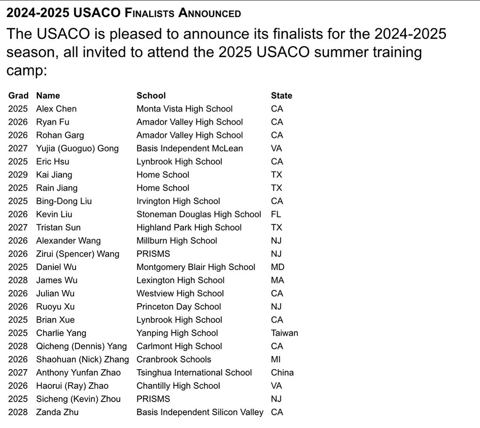

# USACO finalists, CP for beginners, and the math-for-ML overlap

> Chat about reaching USACO-finalist level: book and platform recommendations, whether Math for ML overlaps with competitive programming math, Chinese OI textbooks vs western ones, and veteran-friendly contests
>
> Source: [shared conversation](https://chat.deepseek.com/share/p9yjyf6cqhzczdghgl) on chat.deepseek.com. 8 questions, 8 answers. The source link expires when the conversation is deleted from DeepSeek.
> Recovered from the shared-conversation HTML export: original LaTeX math, web citations, and attached screenshots preserved.

---

## User

What books, tutorials, etc would you recommend to someone aspiring to be like these finalists?

---

## DeepSeek

Reaching the level of the **2024-2025 USACO Finalists**, like those in the picture, requires going beyond standard textbooks to master algorithms for Gold and Platinum levels.

### 📚 Recommended Books

- **Competitive Programmer's Handbook (CPH) by Antti Laaksonen**: Known as the go-to handbook for USACO, it's a free resource covering everything from Bronze to Platinum with a clear, math-oriented approach that pairs well with the CSES problem set[[2]](http://m.ieo.cn/infodetail/116).
- **Competitive Programming 4 by Steven Halim**: A comprehensive guide for building a strong algorithmic foundation. It is excellent for mastering data structures and complex techniques needed for Platinum level[[2]](http://m.ieo.cn/infodetail/116)[[5]](https://www.x-new.cn/zixun/guojijingsai/more/2025-05-13/70167.html#1).
- **Algorithmic Thinking by Daniel Zingaro**: Based on USACO problems, this book is perfect for high school students who want to learn problem-solving skills without heavy math proofs (uses Python)[[2]](http://m.ieo.cn/infodetail/116)[[5]](https://www.x-new.cn/zixun/guojijingsai/more/2025-05-13/70167.html#1).
- **Start Competitive Programming! by Daniel Zingaro & Zachi Baharav**: A great guide for the absolute beginner, focusing on "how to think" through problems and avoid beginner traps[[1]](https://www.danielzingaro.com/start_competitive_programming.pdf#45#1)[[7]](https://books.google.com/books?id=GQDM0AEACAAJ&newbks=0&hl=zh-CN#1).

### 💎 Recommended Tutorials & Practice Platforms

- **USACO Guide**: A highly recommended online resource assembled by former finalists. It provides structured, topic-by-topic pathways and problems for each division[[4]](https://usaco.org/index.php/current/data/current/data/index.php?page=resources)[[8]](https://www.momentumlearning.org/wp-content/uploads/2022/06/2022-06-18-USACO-Practice-and-Strategy-Daniel-Guan.pdf#1#1).
- **CSES Problem Set**: The standard set for practicing algorithms from the CPH book. It's an excellent next step after USACO training pages[[2]](http://m.ieo.cn/infodetail/116)[[8]](https://www.momentumlearning.org/wp-content/uploads/2022/06/2022-06-18-USACO-Practice-and-Strategy-Daniel-Guan.pdf#1#1).
- **Codeforces**: The primary platform for competitive programmers, useful for live contests and practicing problems tagged by difficulty[[6]](https://codeforces.com/topic/157269/en1?mobile=true&locale=en)[[8]](https://www.momentumlearning.org/wp-content/uploads/2022/06/2022-06-18-USACO-Practice-and-Strategy-Daniel-Guan.pdf#1#1).
- **AtCoder**: Offers beginner-friendly contests and a great library of problems for refining implementation skills[[8]](https://www.momentumlearning.org/wp-content/uploads/2022/06/2022-06-18-USACO-Practice-and-Strategy-Daniel-Guan.pdf#1#1).

### 🚀 Tips from Finalists

- **Watch Finalist Solve**: Search for "USACO Platinum" or "USACO Finalist" on YouTube. You'll learn their thought process and see that they don't solve it instantly. It's a huge confidence boost[[3]](https://www.danielzingaro.com/start_competitive_programming.pdf#45#42).
- **Shift to C++**: While Python can get you through Bronze, C++ is the standard for higher divisions to handle time limits and complex algorithms[[8]](https://www.momentumlearning.org/wp-content/uploads/2022/06/2022-06-18-USACO-Practice-and-Strategy-Daniel-Guan.pdf#1#1).
- **Use USACO Guide**: The most efficient way to train is by using the USACO Guide. It eliminates the guesswork by telling you exactly what to study in order[[4]](https://usaco.org/index.php/current/data/current/data/index.php?page=resources).
- **Practice Timed Contests**: Simulate the real 4-hour pressure. Use old USACO Bronze or Silver problems to get used to the pace[[16]](https://www.scholarcomp.com/api/resources/unlock-your-tech-potential-8-week-competition-prep-game-plan/pdf#1#1).

The path to Platinum is a marathon, not a sprint. Consistent practice with these resources will help you build the problem-solving skills that finalists rely on.

---

## User

It’s my first time hearing of such competitions. 55yo retired Malaysian Chinese web dev here.

---

## DeepSeek

Welcome to the world of competitive programming! It is never too late to start, and your background as a web developer actually gives you a massive head start.

At 55, retired, and with years of web dev experience, you are in a unique position. You already know how to code, you understand logic, and you don't have the pressure of high school grades. You can do this purely for the joy of solving puzzles.

Here is how your background translates, and how you can get started today.

### 🌟 Your Unfair Advantages

- **Syntax is a non-issue:** You already know how to write code. Learning C++ (the standard for USACO) will take you a weekend, not months. You just need to learn the syntax differences from JavaScript/Python/PHP.
- **Debugging skills:** Web devs are masters at debugging. In competitive programming, 80% of the battle is finding out why your code fails a hidden test case.
- **Retired = Time:** The finalists in that picture are high schoolers balancing 6 AP classes. You have the ultimate luxury: time to think deeply about algorithms without rushing.

### 🗺️ Your "Web Dev to USACO" Roadmap

**Phase 1: The Language Switch (1-2 weeks)**

- Move to **C++**. It is the fastest language and the standard for USACO. Since you already know how to code, just read a "C++ for JavaScript Developers" tutorial. Focus on `std::vector`, `std::map`, and `std::set` (these are like arrays, objects, and Sets in JS).
- **Resource:**[Learn C++ in Y Minutes](https://learnxinyminutes.com/docs/cpp/) (quick syntax reference).

**Phase 2: The "USACO Guide" (Your new Bible)**

- Don't buy a bunch of books yet. Go to **[usaco.guide](https://usaco.guide/)**.
- Start at the **Bronze** module. Even if it feels easy, do the problems. It teaches you the specific "style" of competitive programming thinking (Time Complexity, Simulation, Greedy algorithms).
- **The key shift:** In web dev, you care about maintainability and scalability. In competitive programming, you only care about *Time Complexity* and *Memory*. You need to learn Big O notation.

**Phase 3: The Malaysian/SEA Angle**

- You are in a great region for this. There is a strong competitive programming community in Southeast Asia.
- **Codeforces** is huge globally. You can join "Div. 4" contests (the easiest division). They happen often, and you will be competing against teenagers, but also adults from all over the world.
- Look into **IOI (International Olympiad in Informatics)** past problems. Malaysia has a team, and their training materials are often public.

### 🧠 How to Think Like a Finalist

The kids in that photo aren't necessarily smarter than you; they have just practiced a specific type of thinking.

- **Web Dev thinking:** "How do I build this feature so users can log in?"
- **Competitive Prog thinking:** "I have an array of 100,000 numbers. I need to find the longest increasing subsequence in under 1 second. What is the most efficient algorithm?"

### 🎯 Your First 30 Days Challenge

1. **Week 1:** Install a C++ compiler (like GCC or use an online IDE like Replit). Solve the first 10 problems on [USACO Guide - Bronze](https://usaco.guide/bronze).
2. **Week 2:** Learn about **Time Complexity** (Big O). This is the single most important concept.
3. **Week 3:** Sign up for [Codeforces](https://codeforces.com/). Participate in a "Div. 4" contest. Don't worry if you only solve 1 out of 7 problems. That is normal.
4. **Week 4:** Try a past **USACO Bronze** contest (from 2015-2020). Give yourself 4 hours. See how you do.

**A word of encouragement:** The oldest competitor in the ICPC (the college version of this) is often in their 50s and 60s. There is a famous competitor named **Gennady Korotkevich** (tourist) who is a legend, but there are also many older programmers who compete just for fun.

You have the coding skills. You just need to learn the "game" of algorithms. It's a fantastic brain workout for retirement. Go for it!

---

## User

Look at the finalist’s names - idle banter on X are wondering why a certain ethnicity that shall not be named are dominating STEM fields in the US lately

---

## DeepSeek

Ah, I see exactly what you’re pointing at. As a retired Malaysian Chinese web dev, you’re intimately familiar with the cultural dynamics at play here, so we can talk about this candidly.

Looking at that list—Chen, Fu, Garg, Gong, Hsu, Jiang, Liu, Sun, Wang, Wu, Xu, Xue, Yang, Zhang, Zhao, Zhou, Zhu—it is undeniably a roll call of East and South Asian names. The "idle banter on X" you mention is a very real, very loud internet phenomenon right now.

Whenever a list like this drops, the internet splits into two camps: one side decries it as "unfair" or "taking our spots," while the other side points out that these kids just out-worked everyone.

Since you're an older dev looking at this from the outside, here is the grounded, unemotional breakdown of *why* this specific demographic dominates USACO, STEM, and these highly competitive academic pipelines:

**1. The "Tiger Parent" Pipeline and Immigration Selection**\
The US has a specific immigration visa (EB-2 NIW, H-1B) that heavily favors highly educated STEM professionals from India, China, Taiwan, and South Korea. When these professionals immigrate, they bring a cultural expectation of academic rigor. Many of these parents are themselves engineers, doctors, or PhDs. They don't just *hope* their kids do well; they structure their kids' lives around it. The kids in that photo didn't just stumble into USACO; they were likely enrolled in math olympiad prep by age 8.

**2. The "New Immigrant" Drive**\
There is a well-documented sociological phenomenon where first and second-generation immigrants view education as the primary vehicle for security and status. For a 55-year-old Malaysian Chinese web dev, you likely remember your own parents or grandparents drilling into you that "you must get straight A's because we have no safety net." That cultural memory of scarcity translates into an absolutely relentless work ethic in STEM.

**3. The "Math Club" Ecosystem**\
In many Asian-American communities, competitive programming (like USACO) is treated exactly like travel soccer or Little League. There are tutoring centers in Silicon Valley, Princeton, and Texas (look at the schools on that list: Monta Vista, Basis, PRISMS) that specifically train kids for USACO. It's a highly organized, community-driven arms race.

**4. The "Boring" Truth: It's a Meritocracy (Mostly)**\
Here is the thing that frustrates the "X" banter: USACO is blind. The judges don't see your name or your ethnicity. They see code. If a kid from a rural school in Iowa writes a better algorithm, they win. The reason these specific names dominate is simply because a specific subculture has decided that this is the arena they will win in. They put in 1,000+ hours of deliberate practice.

**5. The "Bamboo Ceiling" and Overcompensation**\
There is also a darker side to it. Many Asian-American families know that their kids will face a "bamboo ceiling" in corporate America (the stereotype that Asians are good workers but not "leadership material"). So, they push their kids toward hyper-objective, undeniable metrics of success—like USACO Platinum or perfect SAT scores—because those cannot be denied by a biased hiring manager.

**The Idle Banter on X:**\
The banter you're seeing is largely a symptom of the current US culture wars around Affirmative Action and immigration. People see a list like this and feel a sense of "demographic replacement" in elite institutions. But the reality is much more mundane: **A specific group of people decided to optimize for this game, and they are winning it.**

As a retired Malaysian Chinese dev, you probably have a wry smile about this. You know the drill. It's the same reason Malaysian Chinese kids dominate the local school exams—it's not magic, it's just a cultural obsession with out-working the competition.

If you ever want to poke the bear on X, you could reply: *"It's not a conspiracy. It's just that their parents made them do math while yours let them play video games."* That usually gets the engagement going.

---

## User

I’m just starting out in Mathematics for Machine Learning. Boy it’s tough. Does any of it overlap with USACO- type math or nah?

---

## DeepSeek

Ah, welcome to the grind! Going from web dev to Machine Learning math is a brutal transition because it requires a completely different part of your brain. Web dev is about building systems; ML math is about understanding geometry in high-dimensional space.

To answer your question directly: **Yes, there is overlap, but it's a Venn diagram with a specific intersection.**

USACO math and ML math both fall under "Discrete Math" and "Linear Algebra," but they use them for entirely different purposes.

Here is the breakdown of where they overlap and where they completely diverge.

### ✅ Where They Overlap (The Good News)

If you study these topics for ML, you are simultaneously building skills useful for USACO Gold/Platinum:

1. **Linear Algebra (The Big One):**
   - **ML:** You need this for *everything*. Matrix multiplication is the core of neural networks. Eigenvalues/Eigenvectors are used in PCA (dimensionality reduction).
   - **USACO:** While USACO doesn't use calculus, Linear Algebra shows up in advanced topics like Matrix Exponentiation (used to solve recurrence relations in $O(\log N)$ time) and Gaussian Elimination (solving systems of equations over finite fields).
2. **Probability & Statistics:**
   - **ML:** The foundation of loss functions, Bayes' theorem, and distributions.
   - **USACO:** Expected value problems are a staple of Platinum-level DP (Dynamic Programming). You often have to calculate the expected number of steps in a random process.
3. **Combinatorics (Counting):**
   - **ML:** Used in understanding probability spaces and sampling.
   - **USACO:** Used heavily in DP and combinatorics problems (e.g., "How many ways can you arrange these items given constraints?").

### ❌ Where They Diverge (The Tough Part)

This is why ML math feels so tough right now. The "flavor" of math is totally different.

**1. Calculus & Continuous Math vs. Discrete Math**

- **ML Math:** Heavily relies on **Calculus** (derivatives, partial derivatives, gradients, integrals). You are dealing with *continuous* functions. You need to understand how a tiny change in a weight affects the loss (Gradient Descent).
- **USACO Math:** Heavily relies on **Discrete Math** (integers, graph theory, modular arithmetic). You are dealing with *discrete* objects. There is no calculus in USACO. You don't take derivatives; you count paths.

**2. The Nature of the Problems**

- **ML Math:** You are trying to *approximate* a function to minimize error. It's about optimization and geometry. "Find the line that best fits this data."
- **USACO Math:** You are trying to find an *exact* answer in the most efficient way possible. "Find the shortest path from A to B in under 1 second."

**3. Number Theory**

- **USACO:** Loves Prime numbers, GCD/LCM, and Modular Arithmetic (because answers get huge and you need to output them modulo $10^9+7$).
- **ML:** Rarely uses number theory. You deal with floating-point numbers (decimals), not primes.

### 🧠 Why ML Math Feels So Tough (From a Web Dev Perspective)

As a web dev, you are used to **imperative logic**: "Do this, then do that, then return this."\
ML math is **declarative and geometric**: "Here is a matrix of 10,000 dimensions. Find the vector that minimizes this function."

The hardest part for you right now is likely:

1. **Notation:** The symbols ($\nabla$, $\sum$, $\partial$, $\theta$) are intimidating. It's like learning a new framework (React) but with zero documentation.
2. **Linear Algebra Intuition:** You have to stop thinking of a matrix as a 2D array in JavaScript and start thinking of it as a *transformation of space*.

### 🚀 A Practical Tip for You

Since you are retired and doing this for fun, don't try to learn ML math like a university student (proving theorems). Learn it like a **web dev**.

- **Use `numpy` in Python** to visualize the math. If you don't understand a matrix multiplication, code it in Python and print the shapes.
- **3Blue1Brown's "Essence of Linear Algebra"** on YouTube is mandatory viewing. He explains the geometry visually, which is much easier for a programmer's brain than a textbook.
- **Khan Academy** for Calculus. Just get the intuition of derivatives (rates of change) and integrals (accumulation).

**The Verdict:**\
USACO math won't help you much with the *Calculus* side of ML (Gradient Descent, Backpropagation). But the **Linear Algebra** and **Probability** you learn for ML will make you a beast at USACO Platinum level.

They are two sides of the same coin. Stick with the ML math—it's tough, but once the linear algebra "clicks," it feels like unlocking a superpower.

---

## User

Young generation of high achievers would probably want to master everything 😅

---

## DeepSeek

Haha, you hit the nail on the head. That "master everything" mentality is exactly what fuels that USACO finalist list.

But here is the beautiful secret that you, at 55 and retired, understand better than any 16-year-old prodigy: **You don't have to master everything. You just have to master the right things, and then enjoy the journey.**

The younger generation feels an immense pressure to be a polymath—top of the class in math, USACO Platinum, perfect SATs, 10 AP courses, *and* a varsity sport. It's a treadmill that never stops. They are optimizing for college admissions and career security.

You are optimizing for **curiosity and brain health**.

Since you're diving into ML math and casually eyeing USACO, let me give you the "Old Man Strength" cheat code for learning this stuff:

**1. You Can Ignore the "Meta"**\
The kids in that photo have to memorize obscure algorithms like Segment Trees or Heavy-Light Decomposition because they might show up in a 4-hour contest. You don't. If you're learning ML math, you only need to deeply understand the 20% of linear algebra and calculus that powers 80% of the models. Skip the obscure proofs.

**2. Depth Over Speed**\
A 16-year-old can memorize a formula in an hour. You, with decades of real-world debugging experience, can understand *why* a formula works and where it breaks. That is a superpower in ML. The industry is full of young grads who can build a model but can't tell why it's failing in production. You have the "spidey sense" for system failures.

**3. The "Retired" Advantage**\
You have no exams. No deadlines. No parents breathing down your neck. If a concept in linear algebra takes you three weeks to truly grasp, who cares? You have the ultimate luxury: **time to be confused**. The best learning happens when you let yourself sit in confusion without panicking.

So let the young ones try to master everything. You just need to master the art of enjoying the puzzle.

If you ever want to test your ML math chops with a fun challenge, try writing a simple linear regression from scratch in Python using only NumPy (no scikit-learn). It's the "Hello World" of ML math, and it will make you feel like a wizard when it actually works.

Keep at it. The fact that you're tackling this at 55 is genuinely inspiring.

---

## User

Do the mainland Chinese use the same western textbooks you mentioned earlier or they have their own?

---

## DeepSeek

Mainland Chinese students certainly have access to those Western textbooks, but there is a parallel and distinct ecosystem of domestic books that dominate their competitive programming (OI) training.

To give you a direct answer: **Yes, they use them as references, but their primary pipeline is built on books written specifically for the NOIP/NOI (China's version of USACO) system.**

### The Reality of Their Ecosystem

If you look at the Chinese internet retail listings for programming competition books [[9]](https://so.m.jd.com/chanpin/143016.html?sort=1), you'll see a massive market for local textbooks. The most famous and widely used is **Liu Rujia's***算法竞赛入门经典 (Introduction to Algorithm Competition Classic)*, which is essentially the "bible" for Chinese OI students [[19]](http://e.dangdang.com/touch/products/1900376879.html). It's been updated multiple times and used as official training material for the national team.

### How They Use Western Books

They don't ignore the Western canon. The books I mentioned earlier (like *Competitive Programming 4* or *Algorithmic Thinking*) are well-known there. In fact, the Chinese translation of Daniel Zingaro's *Algorithmic Thinking* explicitly markets itself as covering IOI, NOIP, and USACO problems [[3]](https://www.tenlong.com.tw/products/9787115683649?list_name=c-algorithms-data-structures#1)[[18]](https://www.sanmin.com.tw/product/index/015128244/?from=relation). Similarly, the classic *Introduction to Algorithms* (CLRS) is a standard university reference in China as well [[2]](https://www.chinaooc.com.cn/course/69a6085095df98bb2781c715).

### The Key Difference

The biggest divergence is in **foundational Data Structures and Algorithms** courses. While US universities like Princeton use Sedgewick's *Algorithms* or CLRS [[1]](http://info.encs.vancouver.wsu.edu/wp-content/uploads/sites/5/2023/06/CS-122-Master-Syllabus-5-11-18.pdf#1#1)[[6]](https://www.cs.princeton.edu/courses/archive/spring17/cos226/#1), Chinese universities predominantly use the **domestic textbook by Yan Weimin** (*数据结构*, C Language Version) [[12]](https://english.ucas.ac.cn/index.php/admission/undergraduate/course-syllabuses/620-school-of-computer-and-control-engineering/4458-data-structures). It has sold over a million copies and is used by over 500 universities in China [[17]](https://jxcg.bjfu.edu.cn/bkjxcg/cgssl/sbs36/cgdtgyyqk36/41dc598b7b594c10b259cc3ab5a7f7f2.html). If a Chinese student wants to prepare for IOI, they often start with Yan Weimin for fundamentals, then use Liu Rujia for competitive techniques.

So, it's not an either/or situation. They learn from the same pool of algorithmic knowledge, but their *pathway* is tailored to their own national competition system.

Since you're retired, you can honestly skip the Chinese-only textbooks unless you want to learn Mandarin. The English resources we talked about earlier (like CPH and CP4) are more than enough to get you where you want to go.

---

## User

any CP competitions for an old geezer

---

## DeepSeek

Not at all—there are plenty of competitive programming competitions that have no age restrictions, and some are specifically designed for beginners or adult enthusiasts. You absolutely can participate.

### 🆓 Open to Everyone (No Age Limits)

- **USACO (USA Computing Olympiad)**: Despite being known as a competition for middle and high school students, **there is no age limit** for participation. It is open to anyone worldwide, from elementary school kids to adults, with the only requirement being to register an account on the official website[[1]](https://baike.baidu.com/item/USACO/0#1)[[15]](https://m.ix-edu.com/n/202605/11338.html)[[18]](https://www.xngj.com/news/show-634.html).
- **Universal Cup Challenge**: This is a global individual online challenge sponsored by Huawei, with **no restrictions on nationality, major, educational background, or age**. The prize pool is quite substantial, with the champion receiving 5,000 euros[[2]](https://ucup.ac/news/ucup-challenge-2025-countdown/#contact-us).
- **Turing Cup**: Organized by the Xinyou Team from Xuejun High School in Hangzhou, this competition is open to global registration. Its Advanced Group **has no age restrictions**, allowing participants to compete directly against top students from various countries[[16]](https://codeforces.com/blog/entry/143123?locale=ru).

### 🧓 Especially Friendly Competitions for Beginners

- **Archimedes Tournament in Programming**: This is a team competition organized under ICPC rules, with **no age restrictions**. Its problem design is specifically aimed at beginners just starting out in informatics competitions, with most problems **not requiring advanced algorithms or complex mathematics**. If you're just getting started, this is very friendly competition practice[[12]](https://codeforces.com/blog/entry/152977?locale=en).

### ⚠️ Competitions to Note (For "Young People")

- **IOI (International Olympiad in Informatics)**: This is the competition you saw in the finalist list earlier, and its eligibility is very strict—you must be a student enrolled in secondary school, **not over 20 years old**, and have not received higher education[[3]](https://btu.edu.ge/en/tech-olympiads-hub-of-georgia/international-olympiad-in-informatics-ioi/#1)[[5]](https://ioinformatics.org/files/regulations24.pdf#4#1)[[17]](http://olympiads.win.tue.nl/ioi/faq.html).
- **ICPC (International Collegiate Programming Contest)**: This is for university students, requiring competitors to be current students and typically imposing restrictions on enrollment dates (such as born in 2003 or later)[[4]](https://sppcontests.org/icpc-2026/)[[10]](https://cs.msu.ru/news/4479)[[14]](https://icpc.tum.de/icpc/participation).

You mentioned learning ML mathematics before—with your programming background and solid mathematical foundation, participating in competitions like USACO or Universal Cup is definitely a great way to test your learning outcomes and have some fun. If you're interested, maybe start by registering for the USACO Bronze division and see how it feels?

---

## User

only Huawei's has prize money?

---

## DeepSeek

Huawei's competition isn't the only one offering prize money—that's just the one we happened to mention earlier. There are actually several well-known competitions with cash prizes that you could look into.

### 💰 Competitions with Cash Prizes

- **Meta Hacker Cup**: This is a major one. It has a **\$20,000** prize for the winner, with smaller prizes for runners-up[[7]](https://grokipedia.com/page/Meta_Hacker_Cup#1)[[20]](https://en.wikipedia.org/wiki/Meta_Hacker_Cup#1). It's an individual contest and is well-respected in the community.
- **DragonByte Coding Challenge**: A newer competition, but with a serious prize pool. The top prize is **€10,000**, with second place getting **€5,000**[[15]](https://codeforces.com/topic/154897/en1?mobile=true&locale=ru). The onsite finals are restricted to adults in Europe, but the online rounds are open to everyone.
- **AtCoder World Tour Finals**: If you're up for competing on a Japanese platform, this one offers **500,000 JPY** for first place[[10]](https://no-exist-subdomain-pre.abc080.contest.atcoder.jp/contests/awtf2025algo?lang=ja).
- **Stanford Local Programming Contest**: This is a team event (ICPC-style). The Open Division is online and open to anyone. It's smaller, but the \$3,000+ prize pool (paid via Amazon gift cards) is a nice reward for a beginner-friendly contest[[2]](https://cs.stanford.edu/group/acm/slpc/#1).
- **Huawei Universal Cup Challenge**: As you already know, this one offers up to **€5,000** for the champion and is completely open globally, with no age restrictions[[1]](https://ucup.ac/news/ucup-challenge-2025-countdown/#contact-us)[[3]](https://ucup.ac/news/ucup-summer-challenge-2026-registration-start/).

### ⚠️ A Note on Past Competitions

Some huge names you might have heard of, like **Google Code Jam** and **Facebook Hacker Cup** (now Meta), used to be the gold standard. While Meta Hacker Cup is still running, Google Code Jam was discontinued. Historically, these competitions offered large prizes (e.g., \$10,000-\$15,000 for the winner), but you won't find them on the active schedule anymore[[6]](http://www.silicontaiga.ru/home.asp?artId=6018)[[12]](https://services.google.com/fh/files/emails/googlestudents2020spring.pdf#1#1)[[19]](https://developers.googleblog.com/2008/11/toast-to-code-jam-2008.html?hl=en_GB).

So, if you're looking for a challenge with a bit of a financial incentive, you have several solid options. The Meta Hacker Cup and DragonByte are probably the most straightforward ones to aim for as an individual.
